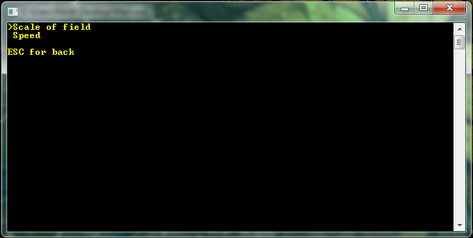
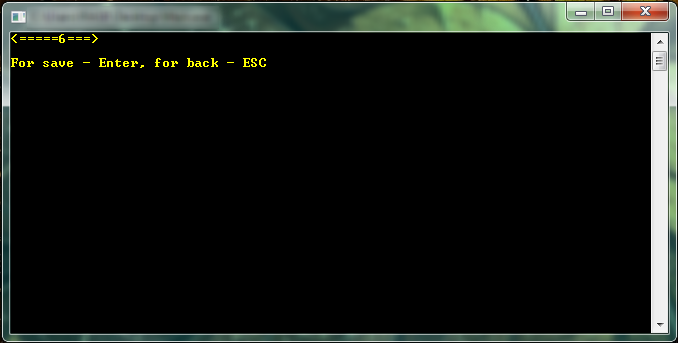
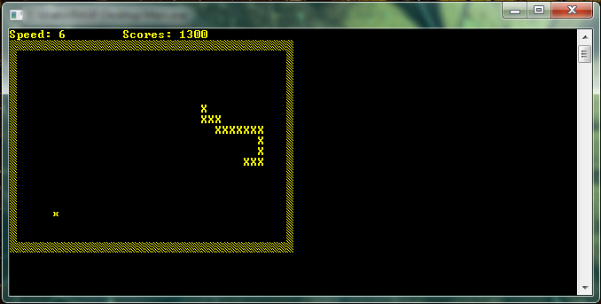

# Snake
A simple console snake made as part of training with C#. The game has a menu, settings, control by clicking (without pressing enter). Maybe i'll add something later.

#### I tried to make the menu the way it was not used to seeing in the console

#### ...and the settings menu also

#### Different view for different settings, for example speed is adjusted by the slider:

#### I also used the ascii symbols for beauty in the game

> _Cool, now I know how to create "readme" with screenshots_ **:P**
